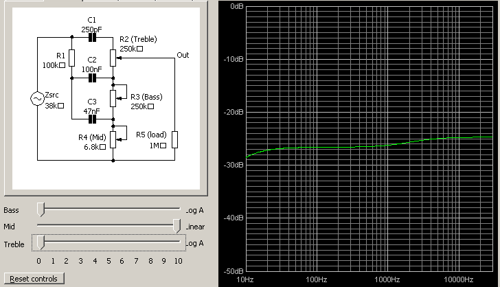
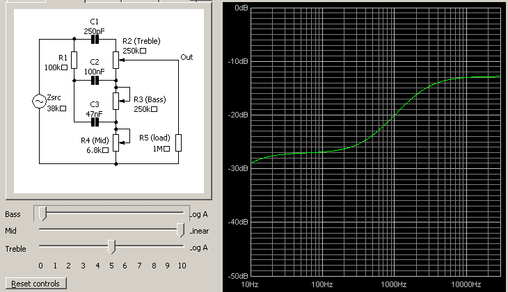
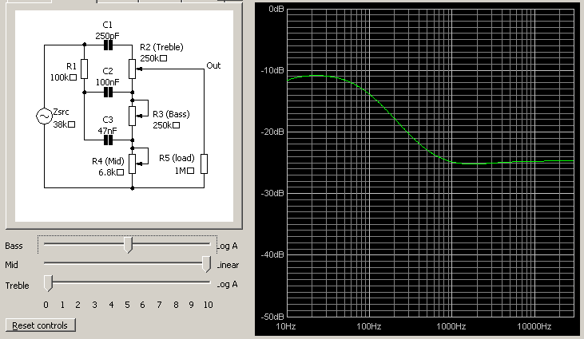
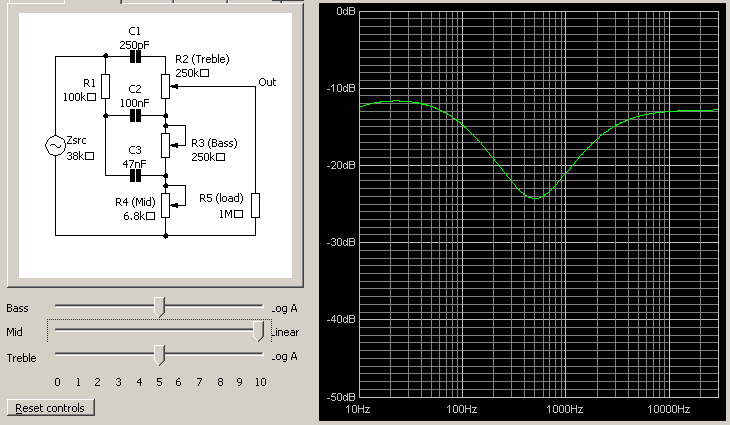
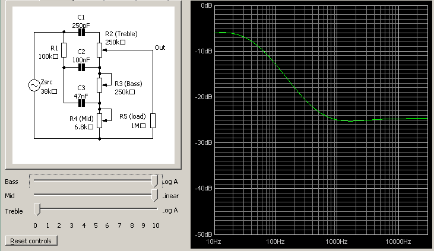
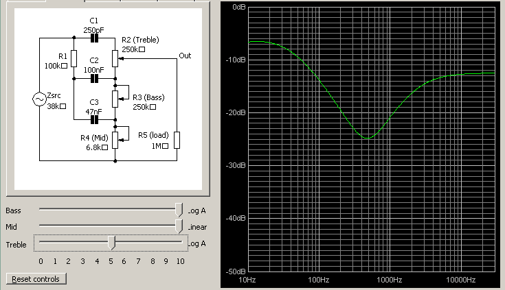
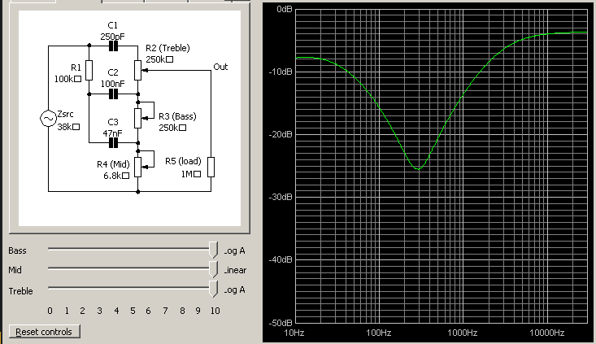

# BBM Hardware

Hardware for a guitar amp based off a classic that was all about the bass, man!

## Topology

- single channel
- 2-triode preamp with bass/treble/volume
- 6L6-based power amp
- solid-state rectifier

## Build Overview

- PCB build
- hard-wired heaters for tubes
- headers from PCB to chassis-mounted components
- carbon comp signal resistors
- metal-film power resistors
- front and rear panels made of PCB ala synth modules
  - symbols instead of labels ala Orange (treble clef, bass clef, etc.)

## Tonestack Curves

The following images were created using [Duncan's Tonestack Calculator](http://www.duncanamps.com/tsc/download.html). 

